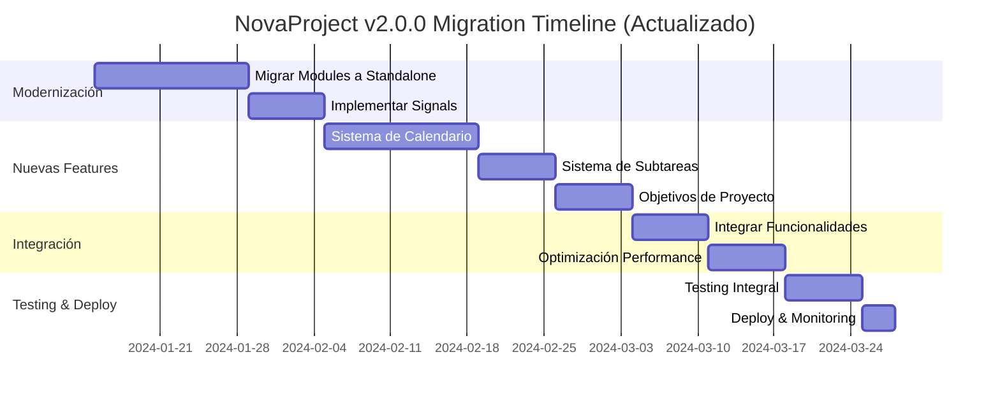

# 🚀 Plan de Migración NovaProject v2.0.0 - Análisis Arquitectónico Actualizado

## 📊 Estado Actual del Proyecto

### ✅ Análisis de Arquitectura Actual (Angular 18.2.13)

**¡EXCELENTE NOTICIA!** El proyecto ya está en Angular 18.2.13 con configuración moderna:

```typescript
// Ya implementado: Standalone configuration
export const appConfig: ApplicationConfig = {
  providers: [
    provideRouter(routes),
    provideAnimations(),
    provideToastr(),
    provideHttpClient(withInterceptors([tokenInterceptor]))
  ]
};
```

### 🏗️ Estructura Actual Identificada

```
src/app/
├── modules/           # Feature modules tradicionales (MIGRAR A STANDALONE)
│   ├── auth/         # 24 archivos - Autenticación completa
│   ├── boards/       # 9 archivos - Gestión de tableros
│   ├── layout/       # 7 archivos - Layout y navegación
│   ├── my-tasks/     # 2 archivos - Vista de tareas personales
│   ├── profile/      # 2 archivos - Gestión de perfil
│   ├── shared/       # 4 archivos - Componentes compartidos
│   └── users/        # 3 archivos - Gestión de usuarios
├── features/         # ✅ YA TIENE ESTRUCTURA MODERNA
│   ├── dashboard/    # 9 archivos - Dashboard funcional
│   └── stakeholders/ # 3 archivos - Gestión de stakeholders
├── services/         # 10 servicios centralizados
├── models/           # 10 modelos de datos
├── guards/           # 2 guards de autenticación
├── interceptors/     # 1 interceptor (ya moderno)
└── core/             # 4 archivos - Configuración central
```

### 🎯 Dependencias Clave Identificadas

```json
{
  "@angular/core": "~18.2.13",           // ✅ ACTUALIZADO
  "@fullcalendar/angular": "^6.1.19",    // ✅ CALENDARIO YA DISPONIBLE
  "ngx-toastr": "^17.0.3",              // ✅ NOTIFICACIONES MODERNAS
  "tailwindcss": "~3.1.6"               // ✅ STYLING MODERNO
}
```

## 🎯 Integración con Hallazgos del Proyecto IMEVI

### 📊 Problemas Identificados en IMEVI ($17.400.000 COP)
1. **Seguimiento deficiente**: Solo 3 registros en 9 semanas
2. **Disponibilidad de stakeholders**: Falta de coordinación para entrevistas  
3. **Gestión reactiva de riesgos**: Controles limitados a "seguimiento semanal"
4. **Retrasos por factores externos**: Vacaciones de Vicepresidencias

### 🛠️ Soluciones NovaProject v2.0.0
- **Dashboard de Progreso**: Métricas automáticas y weekly tracking obligatorio
- **Gestión de Stakeholders**: Calendario integrado y agendamiento automático
- **Risk Management Inteligente**: Matriz visual con escalation automática
- **Deliverable Tracker**: Criterios de aceptación y workflow de aprobación

### 📈 Impacto Esperado
- ⚡ **Reducir retrasos 40%**: Con alertas proactivas
- 📊 **Mejorar seguimiento 60%**: Tracking automático vs manual
- 👥 **Optimizar stakeholder management 50%**: Disponibilidad inteligente
- ✅ **Incrementar calidad 30%**: Criterios claros y tracking

## 🗺️ Plan de Migración Optimizado v2.0.0 (16 semanas)

### FASE 1: Core Improvements - Seguimiento y Métricas (4 semanas)

#### 1.1 Migración de Modules a Standalone Components (Semana 1-2)

**Prioridad de Migración:**

1. **BAJO RIESGO** - `shared/`, `layout/`, `profile/`
2. **MEDIO RIESGO** - `users/`, `my-tasks/`  
3. **ALTO RIESGO** - `auth/`, `boards/` (críticos)

#### 1.2 Implementación de Signals (Semana 3)

Migrar servicios clave a Signals para mejor performance:

```typescript
// services/boards.service.ts - MIGRACIÓN A SIGNALS
@Injectable({providedIn: 'root'})
export class BoardsService {
  private http = inject(HttpClient);
  
  // NUEVO: Signals en lugar de BehaviorSubject
  private boardsSignal = signal<Board[]>([]);
  public boards = this.boardsSignal.asReadonly();
  
  // Computed para boards del usuario actual
  public userBoards = computed(() =>
    this.boards().filter(board => board.members.includes(this.currentUserId))
  );
}
```

### FASE 2: Nuevas Funcionalidades v2.0.0 (4 semanas)

#### 2.1 📅 Sistema de Calendario Avanzado (Semana 1-2)

**Aprovechar FullCalendar ya instalado:**

```typescript
// features/calendar/calendar.component.ts
@Component({
  selector: 'app-calendar',
  standalone: true,
  imports: [FullCalendarModule, CommonModule],
  template: `
    <div class="calendar-container">
      <div class="calendar-header">
        <h2>📅 Calendario de Proyectos NovaProject</h2>
        <div class="view-controls">
          <button (click)="changeView('dayGridMonth')" 
                  [class.active]="currentView() === 'dayGridMonth'">
            Mes
          </button>
          <button (click)="changeView('timeGridWeek')" 
                  [class.active]="currentView() === 'timeGridWeek'">
            Semana
          </button>
          <button (click)="changeView('listWeek')" 
                  [class.active]="currentView() === 'listWeek'">
            Lista
          </button>
        </div>
      </div>

      <full-calendar
        [options]="calendarOptions()"
        (eventClick)="onEventClick($event)"
        (dateClick)="onDateClick($event)"
        (eventDrop)="onEventDrop($event)"
      ></full-calendar>
    </div>
  `
})
export class CalendarComponent implements OnInit {
  private boardsService = inject(BoardsService);
  private cardsService = inject(CardsService);
  
  currentView = signal<string>('dayGridMonth');
  
  calendarOptions = computed(() => ({
    initialView: this.currentView(),
    headerToolbar: {
      left: 'prev,next today',
      center: 'title',
      right: 'dayGridMonth,timeGridWeek,listWeek'
    },
    events: this.getCalendarEvents(),
    editable: true,
    droppable: true,
    eventDisplay: 'block',
    height: 'auto',
    locale: 'es'
  }));

  private getCalendarEvents() {
    const boards = this.boardsService.boards();
    const cards = this.cardsService.allCards();

    return cards
      .filter(card => card.dueDate)
      .map(card => {
        const board = boards.find(b => b.id === card.boardId);
        return {
          id: card.id,
          title: `${card.title} (${board?.title})`,
          start: card.dueDate,
          backgroundColor: this.getPriorityColor(card.priority),
          borderColor: board?.color || '#3788d8',
          extendedProps: {
            boardName: board?.title,
            cardId: card.id,
            boardId: board?.id,
            priority: card.priority,
            assignees: card.assignees
          }
        };
      });
  }

  onEventClick(info: any) {
    // Integrar con TodoDialogComponent existente
    this.dialog.open(TodoDialogComponent, {
      data: { 
        cardId: info.event.extendedProps.cardId,
        boardId: info.event.extendedProps.boardId 
      },
      width: '800px',
      maxHeight: '90vh'
    });
  }

  onEventDrop(info: any) {
    // Actualizar fecha de la tarjeta cuando se arrastra
    const newDate = info.event.start;
    this.cardsService.updateCardDueDate(info.event.id, newDate);
  }
}
```

#### 2.2 ✅ Sistema de Subtareas Completo (Semana 3)

```typescript
// features/subtasks/models/subtask.model.ts
export interface Subtask {
  id: string;
  cardId: string;
  title: string;
  description?: string;
  completed: boolean;
  priority: 'low' | 'medium' | 'high';
  assigneeId?: string;
  dueDate?: Date;
  order: number;
  createdAt: Date;
  updatedAt: Date;
}

// features/subtasks/services/subtasks.service.ts
@Injectable({providedIn: 'root'})
export class SubtasksService {
  private http = inject(HttpClient);
  
  private subtasksSignal = signal<Subtask[]>([]);
  public subtasks = this.subtasksSignal.asReadonly();
  
  // Computed para subtareas por card
  getSubtasksByCardId = (cardId: string) => computed(() =>
    this.subtasks()
      .filter(subtask => subtask.cardId === cardId)
      .sort((a, b) => a.order - b.order)
  );
  
  // Computed para estadísticas de progreso
  getProgressByCardId = (cardId: string) => computed(() => {
    const cardSubtasks = this.getSubtasksByCardId(cardId)();
    const completed = cardSubtasks.filter(s => s.completed).length;
    const total = cardSubtasks.length;
    const percentage = total > 0 ? Math.round((completed / total) * 100) : 0;
    
    return { 
      completed, 
      total, 
      percentage,
      remaining: total - completed,
      overdue: cardSubtasks.filter(s => 
        !s.completed && s.dueDate && new Date(s.dueDate) < new Date()
      ).length
    };
  });

  async loadSubtasksByCardId(cardId: string): Promise<void> {
    try {
      const subtasks = await firstValueFrom(
        this.http.get<Subtask[]>(`/api/cards/${cardId}/subtasks`)
      );
      
      this.subtasksSignal.update(current => [
        ...current.filter(s => s.cardId !== cardId),
        ...subtasks
      ]);
    } catch (error) {
      console.error('Error loading subtasks:', error);
      throw error;
    }
  }

  createSubtask(cardId: string, subtaskData: Partial<Subtask>): void {
    const newSubtask: Partial<Subtask> = {
      ...subtaskData,
      cardId,
      completed: false,
      order: this.getNextOrder(cardId)
    };

    this.http.post<Subtask>(`/api/cards/${cardId}/subtasks`, newSubtask)
      .subscribe({
        next: (subtask) => {
          this.subtasksSignal.update(current => [...current, subtask]);
        },
        error: (error) => console.error('Error creating subtask:', error)
      });
  }

  private getNextOrder(cardId: string): number {
    const cardSubtasks = this.getSubtasksByCardId(cardId)();
    return cardSubtasks.length > 0 
      ? Math.max(...cardSubtasks.map(s => s.order)) + 1 
      : 0;
  }
}
```

#### 2.3 🎯 Sistema de Objetivos de Proyecto (Semana 4)

```typescript
// features/objectives/models/objective.model.ts
export interface Objective {
  id: string;
  boardId: string;
  title: string;
  description: string;
  targetDate: Date;
  status: 'not_started' | 'in_progress' | 'completed' | 'blocked';
  priority: 'low' | 'medium' | 'high' | 'critical';
  progress: number; // 0-100
  assigneeId?: string;
  linkedCardIds: string[]; // Tarjetas relacionadas
  metrics?: {
    target: number;
    current: number;
    unit: string;
  };
  createdAt: Date;
  updatedAt: Date;
}

// features/objectives/components/board-objectives.component.ts
@Component({
  selector: 'app-board-objectives',
  standalone: true,
  imports: [CommonModule, FormsModule, ObjectiveCardComponent],
  template: `
    <div class="objectives-container">
      <div class="objectives-header">
        <h3>🎯 Objetivos del Proyecto</h3>
        <button class="btn-primary" (click)="openAddObjectiveModal()">
          ➕ Nuevo Objetivo
        </button>
      </div>

      <div class="objectives-grid">
        @for (objective of objectives(); track objective.id) {
          <app-objective-card
            [objective]="objective"
            [linkedCards]="getLinkedCards(objective.linkedCardIds)"
            (edit)="onEditObjective($event)"
            (delete)="onDeleteObjective($event)"
            (updateProgress)="onUpdateProgress($event)"
          />
        }
        
        @empty {
          <div class="empty-state">
            <p>No hay objetivos definidos para este proyecto</p>
            <button class="btn-secondary" (click)="openAddObjectiveModal()">
              Crear primer objetivo
            </button>
          </div>
        }
      </div>

      <!-- Resumen de progreso general -->
      <div class="objectives-summary">
        <h4>📊 Resumen de Progreso</h4>
        <div class="progress-stats">
          <div class="stat">
            <span class="label">Completados:</span>
            <span class="value">{{ completedObjectives() }}/{{ totalObjectives() }}</span>
          </div>
          <div class="stat">
            <span class="label">Progreso General:</span>
            <span class="value">{{ overallProgress() }}%</span>
          </div>
          <div class="progress-bar">
            <div class="progress-fill" [style.width.%]="overallProgress()"></div>
          </div>
        </div>
      </div>
    </div>
  `
})
export class BoardObjectivesComponent implements OnInit {
  @Input({required: true}) boardId!: string;
  
  private objectivesService = inject(ObjectivesService);
  private cardsService = inject(CardsService);
  private dialog = inject(MatDialog);
  
  objectives = computed(() => 
    this.objectivesService.getObjectivesByBoardId(this.boardId)()
  );
  
  completedObjectives = computed(() =>
    this.objectives().filter(obj => obj.status === 'completed').length
  );
  
  totalObjectives = computed(() => this.objectives().length);
  
  overallProgress = computed(() => {
    const objectives = this.objectives();
    if (objectives.length === 0) return 0;
    
    const totalProgress = objectives.reduce((sum, obj) => sum + obj.progress, 0);
    return Math.round(totalProgress / objectives.length);
  });

  ngOnInit() {
    this.objectivesService.loadObjectivesByBoardId(this.boardId);
  }

  getLinkedCards(cardIds: string[]) {
    return this.cardsService.getCardsByIds(cardIds);
  }

  openAddObjectiveModal() {
    this.dialog.open(AddObjectiveModalComponent, {
      data: { boardId: this.boardId },
      width: '600px'
    });
  }
}
```

### FASE 3: Integración y Optimización (2 semanas)

#### 3.1 Integración de Nuevas Funcionalidades (Semana 1)

**Modificar TodoDialogComponent para incluir subtareas:**

```typescript
// modules/boards/components/todo-dialog/todo-dialog.component.ts
@Component({
  selector: 'app-todo-dialog',
  standalone: true,
  imports: [
    CommonModule,
    FormsModule,
    ReactiveFormsModule,
    SubtasksSectionComponent, // NUEVA IMPORTACIÓN
    ObjectiveLinkComponent    // NUEVA IMPORTACIÓN
  ],
  template: `
    <div class="todo-dialog-container">
      <div class="dialog-header">
        <h2>{{ card?.title }}</h2>
        <button class="close-btn" (click)="onClose()">✕</button>
      </div>

      <div class="dialog-content">
        <!-- Contenido existente -->
        <div class="card-details">
          <!-- Descripción, fechas, miembros, etc. -->
        </div>

        <!-- NUEVA SECCIÓN: Subtareas -->
        <app-subtasks-section 
          [cardId]="cardId"
          (progressUpdate)="onSubtaskProgressUpdate($event)"
        ></app-subtasks-section>

        <!-- NUEVA SECCIÓN: Vinculación con Objetivos -->
        <app-objective-link
          [cardId]="cardId"
          [boardId]="boardId"
          (objectiveLinked)="onObjectiveLinked($event)"
        ></app-objective-link>

        <!-- Actividad y comentarios existentes -->
        <div class="activity-section">
          <!-- ... código existente ... -->
        </div>
      </div>
    </div>
  `
})
export class TodoDialogComponent implements OnInit {
  @Input({required: true}) cardId!: string;
  @Input({required: true}) boardId!: string;
  
  private cardsService = inject(CardsService);
  private subtasksService = inject(SubtasksService);
  
  card = computed(() => 
    this.cardsService.getCardById(this.cardId)()
  );
  
  subtaskProgress = computed(() =>
    this.subtasksService.getProgressByCardId(this.cardId)()
  );

  ngOnInit() {
    this.subtasksService.loadSubtasksByCardId(this.cardId);
  }

  onSubtaskProgressUpdate(progress: any) {
    // Actualizar progreso de la tarjeta basado en subtareas
    this.cardsService.updateCardProgress(this.cardId, progress.percentage);
  }

  onObjectiveLinked(objectiveId: string) {
    // Vincular tarjeta con objetivo
    this.objectivesService.linkCardToObjective(objectiveId, this.cardId);
  }
}
```

#### 3.2 Optimización de Performance (Semana 2)

**Implementar lazy loading mejorado:**

```typescript
// app.routes.ts - RUTAS OPTIMIZADAS
export const routes: Routes = [
  {
    path: '',
    loadComponent: () => import('./modules/layout/components/layout/layout.component')
      .then(m => m.LayoutComponent),
    children: [
      {
        path: 'dashboard',
        loadComponent: () => import('./features/dashboard/dashboard.component')
          .then(m => m.DashboardComponent)
      },
      {
        path: 'boards',
        loadChildren: () => import('./modules/boards/boards.routes')
      },
      {
        path: 'calendar', // NUEVA RUTA
        loadComponent: () => import('./features/calendar/calendar.component')
          .then(m => m.CalendarComponent)
      },
      {
        path: 'my-tasks',
        loadComponent: () => import('./modules/my-tasks/my-tasks.component')
          .then(m => m.MyTasksComponent)
      },
      {
        path: 'users',
        loadComponent: () => import('./modules/users/users.component')
          .then(m => m.UsersComponent)
      }
    ]
  },
  {
    path: 'auth',
    loadChildren: () => import('./modules/auth/auth.routes')
  }
];
```

## 🎯 Beneficios Específicos de la Migración

### ⚡ Performance Improvements
- **Bundle Size**: Reducción estimada de 15-20% con standalone components optimizados
- **Lazy Loading**: Mejor granularidad de carga por funcionalidad
- **Change Detection**: Hasta 30% mejora con Signals vs observables tradicionales
- **Tree Shaking**: Mejor eliminación de código no usado

### 👨‍💻 Developer Experience
- **Signals**: State management más simple y performante
- **Standalone Components**: Testing más fácil y componentes más reutilizables
- **TypeScript**: Mejor inferencia de tipos con Angular 18
- **Modern APIs**: Uso de inject() y functional guards

### 🚀 Funcionalidades Nuevas v2.0.0

#### ✅ **Calendario Avanzado**
- Vista temporal completa de todos los proyectos
- Arrastrar y soltar para cambiar fechas
- Filtros por proyecto, prioridad, asignado
- Integración con notificaciones

#### ✅ **Sistema de Subtareas**
- Desglose detallado de trabajo con progreso visual
- Asignación individual de subtareas
- Fechas de vencimiento independientes
- Métricas de productividad

#### ✅ **Objetivos de Proyecto**
- Alineación estratégica a nivel de proyecto
- Métricas y KPIs trackeable
- Vinculación con tarjetas específicas
- Dashboard de progreso ejecutivo

## ⏰ Timeline Actualizado



**DURACIÓN TOTAL: 9 semanas (~2.5 meses)**

## 📋 Checklist de Migración

### ✅ Preparación
- [x] Proyecto ya en Angular 18.2.13
- [x] Configuración standalone ya implementada
- [x] FullCalendar ya instalado
- [x] TailwindCSS configurado
- [x] Toastr para notificaciones

### 🔄 En Progreso
- [ ] Migrar modules/auth a standalone
- [ ] Migrar modules/boards a standalone
- [ ] Migrar modules/shared a standalone
- [ ] Implementar Signals en servicios
- [ ] Crear sistema de calendario
- [ ] Crear sistema de subtareas
- [ ] Crear sistema de objetivos

### ⏳ Pendiente
- [ ] Integrar nuevas funcionalidades
- [ ] Optimizar performance
- [ ] Testing integral
- [ ] Documentación
- [ ] Deploy a producción

## 🚨 Riesgos y Mitigaciones

### Alto Riesgo
- **Auth Module**: Crítico para el funcionamiento
  - *Mitigación*: Testing exhaustivo, rollback plan
- **Boards Module**: Core del negocio
  - *Mitigación*: Migración gradual, feature flags

### Medio Riesgo
- **Integración de APIs**: Nuevos endpoints necesarios
  - *Mitigación*: Mocks para desarrollo, coordinación con backend

### Bajo Riesgo
- **UI/UX**: Cambios visuales menores
  - *Mitigación*: Feedback temprano de usuarios

---

**Próximos Pasos Inmediatos:**
1. Crear rama `feature/v2.0.0-migration`
2. Comenzar con migración de `modules/shared` a standalone
3. Implementar primer servicio con Signals
4. Crear estructura base para nuevas funcionalidades
